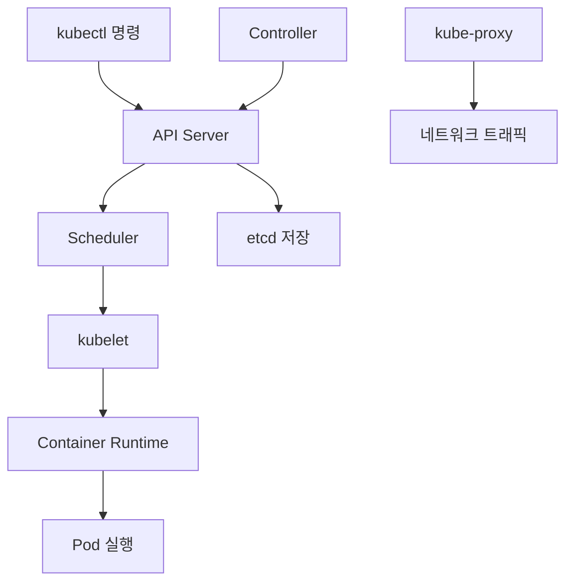

# Kubernetes 기본 구조

## 전체 구조 (쉬운 비유)
Kubernetes 클러스터는 **회사 조직**과 비슷합니다:

```
🏢 Kubernetes 클러스터 = 회사 전체
├── 👔 마스터 노드 = 경영진 (명령과 관리)
│   ├── API Server = 접수처 (모든 요청 처리)
│   ├── Scheduler = 인사팀 (일 배정)
│   ├── Controller = 관리팀 (상태 체크)
│   └── etcd = 회계팀 (모든 정보 저장)
└── 👷 워커 노드 = 직원들 (실제 일 수행)
    ├── kubelet = 팀장 (마스터 명령 수행)
    ├── kube-proxy = 전화교환원 (네트워크 연결)
    └── Pods = 개별 업무 (실제 앱 실행)
```

## 마스터 노드 (Control Plane)
**역할**: 전체 클러스터를 관리하는 두뇌

### API Server
- **역할**: 모든 요청의 **접수창구**
- **예시**: kubectl 명령어를 받아서 처리
- **쉬운 설명**: 회사의 접수처 직원

### Scheduler
- **역할**: Pod를 어느 워커 노드에 배치할지 **결정**
- **예시**: 새로운 앱을 가장 여유로운 서버에 배치
- **쉬운 설명**: 인사팀에서 신입사원을 적절한 팀에 배정

### Controller Manager
- **역할**: 클러스터의 **상태를 지속적으로 체크**
- **예시**: Pod가 죽으면 새로 만들어서 대체
- **쉬운 설명**: 관리팀에서 직원들 상태를 계속 확인

### etcd
- **역할**: 모든 클러스터 정보를 **저장하는 데이터베이스**
- **예시**: 어떤 Pod가 어디에 있는지 모든 정보 저장
- **쉬운 설명**: 회사의 모든 정보를 기록하는 회계장부

## 워커 노드 (Worker Node)
**역할**: 실제로 애플리케이션을 실행하는 일꾼

### kubelet
- **역할**: 마스터 노드의 명령을 받아서 **실행**
- **예시**: "이 Pod를 실행해"라는 명령을 받으면 실행
- **쉬운 설명**: 팀장이 상부 지시를 받아서 팀원들에게 전달

### kube-proxy
- **역할**: 네트워크 **트래픽을 적절히 분배**
- **예시**: 외부에서 오는 요청을 여러 Pod에 골고루 분배
- **쉬운 설명**: 전화교환원이 전화를 적절한 부서로 연결

### Container Runtime
- **역할**: 실제로 **컨테이너를 실행**하는 엔진
- **예시**: Docker, containerd 등
- **쉬운 설명**: 실제 일을 하는 직원들

## 데이터 흐름


## 실제 예시
**"새로운 웹 애플리케이션을 배포하고 싶어요"**

1. **개발자**: `kubectl apply -f app.yaml` 명령 실행
2. **API Server**: 요청을 받고 검증
3. **etcd**: 새로운 배포 정보 저장
4. **Scheduler**: 가장 적절한 워커 노드 선택
5. **kubelet**: 선택된 노드에서 Pod 생성
6. **Container Runtime**: 실제 컨테이너 실행
7. **kube-proxy**: 외부에서 접근할 수 있도록 네트워크 설정

## 고가용성 (HA)
- **마스터 노드**: 보통 3개 이상으로 구성 (한 개가 죽어도 계속 동작)
- **워커 노드**: 여러 개로 구성 (부하 분산 및 장애 대응)
- **etcd**: 홀수 개로 구성 (데이터 일관성 보장)

## 다음 단계
이제 기본 구조를 이해했으니 [[Pod와 Container]]에 대해 알아보세요!

