# Service와 Networking

## Service가 왜 필요한가?

### 문제 상황
```
😰 Pod의 문제점:
- Pod IP는 재시작할 때마다 바뀜 (203.0.113.1 → 203.0.113.5)
- 여러 개의 Pod 중 어디로 접속해야 할지 모름
- 외부에서 Pod에 직접 접근하기 어려움
```

### Service의 해결책
```
😊 Service의 역할:
- 고정된 IP 주소와 DNS 이름 제공
- 여러 Pod에 트래픽을 자동으로 분배
- 외부에서 안전하게 접근할 수 있는 통로 제공
```

## Service 타입별 쉬운 설명

### 1. ClusterIP (기본값)
**비유**: 회사 내부 전화번호
- **용도**: 클러스터 **내부에서만** 접근 가능
- **예시**: 웹 서버가 데이터베이스에 접근할 때
- **특징**: 가장 안전하고 기본적인 방식

```yaml
apiVersion: v1
kind: Service
metadata:
  name: database-service
spec:
  type: ClusterIP  # 생략 가능 (기본값)
  selector:
    app: database
  ports:
  - port: 3306
    targetPort: 3306
```

### 2. NodePort
**비유**: 건물 입구의 특정 문 번호
- **용도**: 외부에서 **노드의 특정 포트**로 접근
- **예시**: 개발 중인 웹 사이트를 외부에서 테스트
- **특징**: 30000-32767 범위의 포트 사용

```yaml
apiVersion: v1
kind: Service
metadata:
  name: web-nodeport
spec:
  type: NodePort
  selector:
    app: web
  ports:
  - port: 80
    targetPort: 80
    nodePort: 30080  # 외부에서 접근할 포트
```

### 3. LoadBalancer
**비유**: 호텔 프런트 데스크 (외부 손님을 적절한 방으로 안내)
- **용도**: **외부 로드밸런서**를 통한 접근
- **예시**: 실제 서비스를 인터넷에 오픈할 때
- **특징**: 클라우드 환경에서 자동으로 로드밸런서 생성

```yaml
apiVersion: v1
kind: Service
metadata:
  name: web-loadbalancer
spec:
  type: LoadBalancer
  selector:
    app: web
  ports:
  - port: 80
    targetPort: 80
```

### 4. ExternalName
**비유**: 전화번호부의 단축번호
- **용도**: 외부 서비스에 **별명**을 붙여서 사용
- **예시**: `google.com`을 `search-engine`이라는 이름으로 사용
- **특징**: DNS CNAME 레코드를 생성

## 실제 사용 시나리오

### 시나리오 1: 웹 애플리케이션 구조

```mermaid
graph TD
    A[외부 사용자] --> B[LoadBalancer Service]
    B --> C[Web Pod 1]
    B --> D[Web Pod 2]
    C --> E[ClusterIP Service]
    D --> E
    E --> F[Database Pod]
```


**설명**:
- 외부 사용자는 LoadBalancer를 통해 접근
- 웹 서버들은 ClusterIP를 통해 데이터베이스 접근

### 시나리오 2: 마이크로서비스 구조
```
🏬 온라인 쇼핑몰:
├── Frontend Service (LoadBalancer) ← 외부 접근
├── User Service (ClusterIP) ← 내부 전용
├── Order Service (ClusterIP) ← 내부 전용
└── Payment Service (ClusterIP) ← 내부 전용
```

## 실습: Service 만들어보기

### 1. 웹 애플리케이션 Pod 생성
```bash
# nginx Pod 3개 생성 (Deployment 사용)
kubectl create deployment web-app --image=nginx --replicas=3
```

### 2. ClusterIP Service 생성
```bash
# ClusterIP 서비스 생성
kubectl expose deployment web-app --port=80 --type=ClusterIP
```

### 3. Service 확인
```bash
# 서비스 목록 보기
kubectl get services

# 서비스 상세 정보
kubectl describe service web-app
```

### 4. NodePort Service 생성
```bash
# NodePort 서비스 생성
kubectl expose deployment web-app --port=80 --type=NodePort --name=web-nodeport
```

### 5. 접근 테스트
```bash
# 클러스터 내부에서 테스트
kubectl run test-pod --image=busybox --rm -it -- wget -qO- web-app

# NodePort로 외부에서 테스트 (minikube의 경우)
minikube service web-nodeport --url
```

## DNS와 Service Discovery

### 자동 DNS 생성
Kubernetes는 Service마다 **자동으로 DNS 이름**을 생성합니다:

```bash
# 형식: service-name.namespace.svc.cluster.local
web-app.default.svc.cluster.local

# 같은 네임스페이스에서는 서비스 이름만으로도 접근 가능
curl http://web-app/
```

### 환경 변수 자동 생성
```bash
# Service가 생성되면 관련 환경 변수도 자동 생성
WEB_APP_SERVICE_HOST=10.96.0.1
WEB_APP_SERVICE_PORT=80
```

## 네트워킹 심화 개념

### 1. Endpoint
- Service가 트래픽을 전달할 **실제 Pod들의 IP 목록**
- Pod가 추가/삭제되면 자동으로 업데이트

```bash
# Endpoint 확인
kubectl get endpoints web-app
```

### 2. Session Affinity
- 같은 사용자의 요청을 **같은 Pod**로 보내는 기능
- 로그인 상태 유지가 필요한 경우 사용

```yaml
spec:
  sessionAffinity: ClientIP  # 같은 IP는 같은 Pod로
```

### 3. Service Port vs Target Port
```yaml
ports:
- port: 80         # Service가 받는 포트
  targetPort: 8080 # Pod가 실제 사용하는 포트
```

## 문제 해결 팁

### Service가 접근되지 않을 때
```bash
# 1. Service 상태 확인
kubectl get service web-app

# 2. Endpoint 확인 (Pod가 연결되어 있는지)
kubectl get endpoints web-app

# 3. Pod의 라벨 확인
kubectl get pods --show-labels

# 4. Service의 selector 확인
kubectl describe service web-app
```

### 일반적인 문제들
- **Selector 불일치**: Service의 selector와 Pod의 label이 다름
- **Port 불일치**: targetPort와 Pod의 실제 포트가 다름
- **Pod 준비 안됨**: Pod가 아직 Ready 상태가 아님

## 다음 단계
Service로 네트워킹을 이해했다면 [[Deployment와 ReplicaSet]]을 통해 Pod를 안정적으로 관리하는 방법을 알아보세요!

#Kubernetes #Service #Networking
