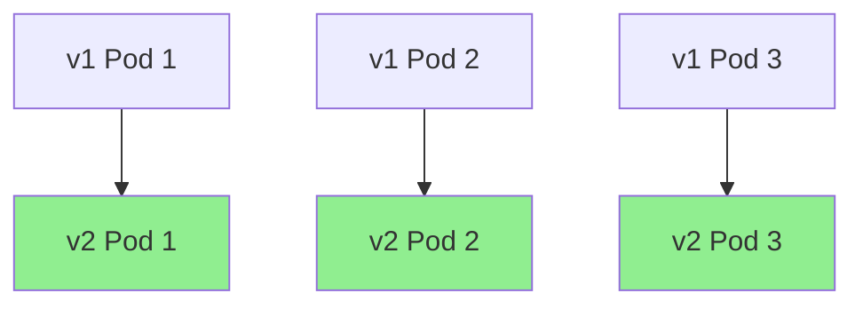
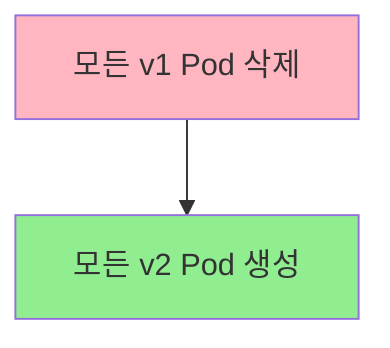

### 3. 세부 정보 확인
```bash
# Deployment 세부 정보
kubectl describe deployment web-app

# 실시간 상태 모니터링
kubectl get pods -w
```

## 업데이트 전략

### 1. Rolling Update (기본값)
**비유**: 버스 정류장에서 버스를 한 대씩 새 모델로 교체



**특징**:
- 서비스 중단 없음
- 점진적으로 업데이트
- 문제 발생 시 중간에 중단 가능

```yaml
spec:
  strategy:
    type: RollingUpdate
    rollingUpdate:
      maxUnavailable: 1    # 최대 1개까지 중단 허용
      maxSurge: 1          # 최대 1개까지 추가 생성 허용
```

### 2. Recreate
**비유**: 공장을 완전히 멈추고 새 설비로 교체



**특징**:
- 잠시 서비스 중단됨
- 빠른 업데이트
- 리소스 절약

```yaml
spec:
  strategy:
    type: Recreate
```

## 실습: 애플리케이션 업데이트

### 1. 초기 배포
```bash
# nginx 1.20 버전으로 배포
kubectl create deployment web-app --image=nginx:1.20 --replicas=3
```

### 2. 이미지 업데이트
```bash
# nginx 1.21 버전으로 업데이트
kubectl set image deployment/web-app nginx=nginx:1.21

# 업데이트 진행 상황 확인
kubectl rollout status deployment/web-app
```

### 3. 업데이트 히스토리 확인
```bash
# 배포 히스토리 보기
kubectl rollout history deployment/web-app

# 특정 리비전 상세 정보
kubectl rollout history deployment/web-app --revision=2
```

### 4. 롤백 (이전 버전으로 되돌리기)
```bash
# 바로 이전 버전으로 롤백
kubectl rollout undo deployment/web-app

# 특정 버전으로 롤백
kubectl rollout undo deployment/web-app --to-revision=1
```

## 스케일링 (확장/축소)

### 수동 스케일링
```bash
# Pod 개수를 5개로 늘리기
kubectl scale deployment web-app --replicas=5

# 현재 상태 확인
kubectl get deployments
```

### YAML로 스케일링
```yaml
spec:
  replicas: 10  # 10개로 확장
```

### 자동 스케일링 (HPA)
```bash
# CPU 사용률 기반 자동 스케일링
kubectl autoscale deployment web-app --cpu-percent=50 --min=1 --max=10
```

## 실제 운영 시나리오

### 시나리오 1: 새 기능 배포
```bash
# 1. 새 버전 배포
kubectl set image deployment/web-app nginx=nginx:1.22

# 2. 배포 상태 모니터링
kubectl rollout status deployment/web-app

# 3. 문제 발생 시 즉시 롤백
kubectl rollout undo deployment/web-app
```

### 시나리오 2: 트래픽 증가 대응
```bash
# 1. 현재 리소스 사용률 확인
kubectl top pods

# 2. Pod 개수 늘리기
kubectl scale deployment web-app --replicas=10

# 3. 트래픽 정상화 후 다시 줄이기
kubectl scale deployment web-app --replicas=3
```

## 고급 설정

### 1. 리소스 제한
```yaml
spec:
  template:
    spec:
      containers:
      - name: nginx
        image: nginx:1.20
        resources:
          requests:    # 최소 보장 리소스
            memory: "64Mi"
            cpu: "250m"
          limits:      # 최대 사용 가능 리소스
            memory: "128Mi"
            cpu: "500m"
```

### 2. Health Check
```yaml
spec:
  template:
    spec:
      containers:
      - name: nginx
        image: nginx:1.20
        livenessProbe:     # 생존 확인
          httpGet:
            path: /
            port: 80
          initialDelaySeconds: 30
          periodSeconds: 10
        readinessProbe:    # 준비 상태 확인
          httpGet:
            path: /
            port: 80
          initialDelaySeconds: 5
          periodSeconds: 5
```

### 3. 업데이트 세부 설정
```yaml
spec:
  strategy:
    type: RollingUpdate
    rollingUpdate:
      maxUnavailable: 25%    # 25%까지 중단 허용
      maxSurge: 25%          # 25%까지 추가 생성 허용
  minReadySeconds: 10        # 새 Pod가 준비된 후 10초 대기
  progressDeadlineSeconds: 600  # 10분 내에 완료되어야 함
```

## 문제 해결

### 일반적인 문제들

#### 1. Pod가 시작되지 않음
```bash
# Pod 상태 확인
kubectl get pods
kubectl describe pod <pod-name>

# 이벤트 확인
kubectl get events --sort-by=.metadata.creationTimestamp
```

#### 2. 업데이트가 진행되지 않음
```bash
# 업데이트 상태 확인
kubectl rollout status deployment/web-app

# Deployment 이벤트 확인
kubectl describe deployment web-app
```

#### 3. 리소스 부족
```bash
# 노드 리소스 확인
kubectl top nodes

# Pod 리소스 사용량 확인
kubectl top pods
```

## Deployment vs StatefulSet vs DaemonSet

### 언제 무엇을 사용할까?

#### Deployment 사용
- **상태가 없는 애플리케이션** (웹 서버, API 서버)
- **수평 확장**이 필요한 경우
- **Rolling Update**가 필요한 경우

#### StatefulSet 사용
- **상태가 있는 애플리케이션** (데이터베이스, 메시지 큐)
- **고정된 네트워크 ID**가 필요한 경우
- **순서대로 시작/종료**가 필요한 경우

#### DaemonSet 사용
- **모든 노드에서 실행**되어야 하는 경우 (로그 수집, 모니터링)
- **노드별로 하나씩**만 실행되어야 하는 경우

## 모니터링과 관리

### 유용한 명령어들
```bash
# 실시간 Pod 상태 모니터링
kubectl get pods -w

# 특정 라벨의 Pod만 보기
kubectl get pods -l app=web-app

# 리소스 사용량 확인
kubectl top pods
kubectl top nodes

# 로그 확인
kubectl logs deployment/web-app

# 모든 리소스 한번에 삭제
kubectl delete all -l app=web-app
```

## 다음 단계
Deployment로 애플리케이션 배포를 마스터했다면 [[ConfigMap과 Secret]]을 통해 설정과 비밀번호를 안전하게 관리하는 방법을 알아보세요!

#Kubernetes #Deployment #ReplicaSet
