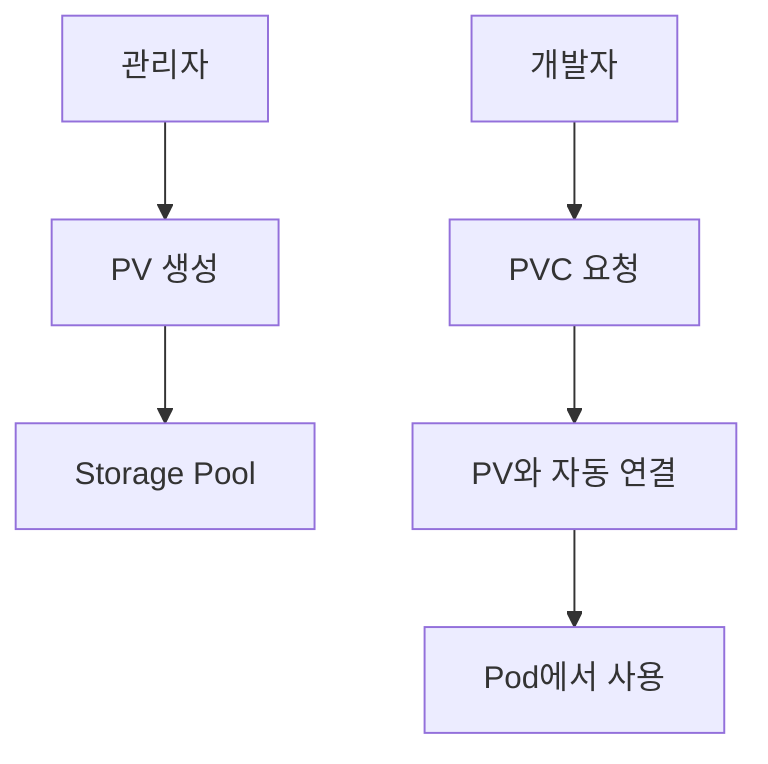

# Volume과 Storage

## 데이터 저장이 왜 중요한가?

### 문제 상황
```
😰 Pod의 데이터 문제점:
- Pod가 재시작되면 모든 데이터가 사라짐
- 같은 애플리케이션의 여러 Pod가 데이터를 공유할 수 없음
- 데이터베이스 같은 중요한 데이터가 유실될 수 있음
```

### Volume의 해결책
```
😊 Volume의 장점:
- Pod가 재시작되어도 데이터 유지
- 여러 Pod 간에 데이터 공유 가능
- 다양한 스토리지 시스템과 연동 가능
```

## Volume 타입별 쉬운 설명

### 1. emptyDir
**비유**: 임시 작업 공간
- **용도**: Pod 내 컨테이너들 간 임시 데이터 공유
- **특징**: Pod 삭제 시 데이터도 함께 삭제
- **예시**: 캐시, 임시 파일, 로그 버퍼

```yaml
apiVersion: v1
kind: Pod
metadata:
  name: web-with-cache
spec:
  containers:
  - name: web-server
    image: nginx
    volumeMounts:
    - name: cache-volume
      mountPath: /tmp/cache
  
  - name: cache-warmer
    image: busybox
    command: ['sh', '-c', 'while true; do echo "cache data" > /tmp/cache/data; sleep 60; done']
    volumeMounts:
    - name: cache-volume
      mountPath: /tmp/cache
  
  volumes:
  - name: cache-volume
    emptyDir: {}
```

### 2. hostPath
**비유**: 호스트 컴퓨터의 폴더를 빌려 쓰는 것
- **용도**: 노드의 파일 시스템에 직접 접근
- **특징**: 해당 노드에서만 접근 가능
- **예시**: 로그 수집, 시스템 모니터링

```yaml
apiVersion: v1
kind: Pod
metadata:
  name: log-collector
spec:
  containers:
  - name: log-reader
    image: busybox
    command: ['tail', '-f', '/host-logs/app.log']
    volumeMounts:
    - name: log-volume
      mountPath: /host-logs
  
  volumes:
  - name: log-volume
    hostPath:
      path: /var/log/myapp
      type: Directory
```

### 3. configMap / secret
**비유**: 설정 파일 보관함에서 파일을 가져와 사용
- **용도**: 설정 파일을 Pod에 마운트
- **특징**: 읽기 전용, 설정 변경 시 자동 업데이트
- **예시**: 애플리케이션 설정, 인증서

```yaml
apiVersion: v1
kind: Pod
metadata:
  name: web-with-config
spec:
  containers:
  - name: nginx
    image: nginx
    volumeMounts:
    - name: config-volume
      mountPath: /etc/nginx/nginx.conf
      subPath: nginx.conf
  
  volumes:
  - name: config-volume
    configMap:
      name: nginx-config
```

## Persistent Volume (PV)와 Persistent Volume Claim (PVC)

### 개념 이해


### 쉬운 비유
- **PV**: 창고 건물 (관리자가 미리 준비)
- **PVC**: 창고 임대 신청서 (개발자가 필요할 때 요청)
- **Binding**: 적절한 창고를 자동으로 배정

### PV 생성 (관리자)
```yaml
apiVersion: v1
kind: PersistentVolume
metadata:
  name: my-pv
spec:
  capacity:
    storage: 10Gi
  accessModes:
    - ReadWriteOnce
  persistentVolumeReclaimPolicy: Retain
  storageClassName: manual
  hostPath:
    path: /data/my-app
```

### PVC 생성 (개발자)
```yaml
apiVersion: v1
kind: PersistentVolumeClaim
metadata:
  name: my-pvc
spec:
  accessModes:
    - ReadWriteOnce
  resources:
    requests:
      storage: 5Gi
  storageClassName: manual
```

### Pod에서 PVC 사용
```yaml
apiVersion: v1
kind: Pod
metadata:
  name: app-with-storage
spec:
  containers:
  - name: app
    image: nginx
    volumeMounts:
    - name: data-volume
      mountPath: /usr/share/nginx/html
  
  volumes:
  - name: data-volume
    persistentVolumeClaim:
      claimName: my-pvc
```

## 접근 모드 (Access Modes)

### ReadWriteOnce (RWO)
- **설명**: 하나의 노드에서만 읽기/쓰기 가능
- **용도**: 데이터베이스, 단일 Pod 애플리케이션
- **예시**: MySQL, PostgreSQL

### ReadOnlyMany (ROX)
- **설명**: 여러 노드에서 읽기만 가능
- **용도**: 정적 콘텐츠, 공유 설정 파일
- **예시**: 웹사이트 이미지, 문서 파일

### ReadWriteMany (RWX)
- **설명**: 여러 노드에서 동시에 읽기/쓰기 가능
- **용도**: 공유 파일 시스템
- **예시**: 로그 수집, 공유 업로드 폴더

## 실습: 데이터베이스 Pod 만들기

### 1. PVC 생성
```yaml
# mysql-pvc.yaml
apiVersion: v1
kind: PersistentVolumeClaim
metadata:
  name: mysql-pvc
spec:
  accessModes:
    - ReadWriteOnce
  resources:
    requests:
      storage: 20Gi
```

```bash
kubectl apply -f mysql-pvc.yaml
```

### 2. MySQL Deployment
```yaml
# mysql-deployment.yaml
apiVersion: apps/v1
kind: Deployment
metadata:
  name: mysql
spec:
  replicas: 1
  selector:
    matchLabels:
      app: mysql
  template:
    metadata:
      labels:
        app: mysql
    spec:
      containers:
      - name: mysql
        image: mysql:8.0
        env:
        - name: MYSQL_ROOT_PASSWORD
          value: "rootpassword"
        - name: MYSQL_DATABASE
          value: "myapp"
        ports:
        - containerPort: 3306
        volumeMounts:
        - name: mysql-storage
          mountPath: /var/lib/mysql
      volumes:
      - name: mysql-storage
        persistentVolumeClaim:
          claimName: mysql-pvc
```

### 3. 데이터 확인
```bash
# 배포
kubectl apply -f mysql-deployment.yaml

# Pod 확인
kubectl get pods

# MySQL에 접속해서 데이터 생성
kubectl exec -it mysql-<pod-id> -- mysql -u root -p

# Pod 삭제 후 재생성해도 데이터 유지 확인
kubectl delete pod mysql-<pod-id>
```

## StorageClass 활용

### 동적 프로비저닝
**StorageClass**는 **자동 창고 건설업체**와 같습니다:
- PVC 요청이 오면 자동으로 PV를 생성
- 다양한 스토리지 타입 지원 (SSD, HDD 등)
- 클라우드 환경에서 특히 유용

```yaml
# storageclass.yaml
apiVersion: storage.k8s.io/v1
kind: StorageClass
metadata:
  name: fast-ssd
provisioner: kubernetes.io/aws-ebs
parameters:
  type: gp3
  fsType: ext4
allowVolumeExpansion: true
reclaimPolicy: Delete
```

### StorageClass를 사용하는 PVC
```yaml
apiVersion: v1
kind: PersistentVolumeClaim
metadata:
  name: app-pvc-ssd
spec:
  accessModes:
    - ReadWriteOnce
  storageClassName: fast-ssd  # 자동으로 SSD PV 생성
  resources:
    requests:
      storage: 100Gi
```

## 실제 사용 시나리오

### 시나리오 1: 웹 애플리케이션 + 데이터베이스
```yaml
# 웹 애플리케이션용 - 공유 업로드 폴더
apiVersion: v1
kind: PersistentVolumeClaim
metadata:
  name: web-uploads-pvc
spec:
  accessModes:
    - ReadWriteMany
  resources:
    requests:
      storage: 50Gi

---
# 데이터베이스용 - 전용 스토리지
apiVersion: v1
kind: PersistentVolumeClaim
metadata:
  name: database-pvc
spec:
  accessModes:
    - ReadWriteOnce
  resources:
    requests:
      storage: 200Gi
```

### 시나리오 2: 로그 수집 시스템
```yaml
apiVersion: v1
kind: Pod
metadata:
  name: log-collector
spec:
  containers:
  - name: app
    image: nginx
    volumeMounts:
    - name: app-logs
      mountPath: /var/log/nginx
  
  - name: log-shipper
    image: fluent/fluent-bit
    volumeMounts:
    - name: app-logs
      mountPath: /var/log/nginx
      readOnly: true
  
  volumes:
  - name: app-logs
    emptyDir: {}
```

## 백업과 복구

### 데이터 백업
```bash
# PVC 데이터를 다른 Pod로 백업
kubectl run backup-pod --image=busybox --rm -it \
  --overrides='{"spec":{"volumes":[{"name":"data","persistentVolumeClaim":{"claimName":"mysql-pvc"}}],"containers":[{"name":"backup","image":"busybox","volumeMounts":[{"name":"data","mountPath":"/data"}]}]}}'

# 백업 수행
tar -czf /tmp/backup.tar.gz /data
```

### 스냅샷 (지원하는 스토리지)
```yaml
apiVersion: snapshot.storage.k8s.io/v1
kind: VolumeSnapshot
metadata:
  name: mysql-snapshot
spec:
  volumeSnapshotClassName: csi-hostpath-snapclass
  source:
    persistentVolumeClaimName: mysql-pvc
```

## 성능 최적화

### 1. 적절한 스토리지 타입 선택
```yaml
# 고성능이 필요한 경우
storageClassName: fast-ssd

# 용량이 중요한 경우
storageClassName: standard-hdd

# 임시 데이터인 경우
emptyDir:
  medium: Memory  # 메모리 기반 (매우 빠름)
```

### 2. I/O 패턴 고려
```yaml
# 순차 접근이 많은 경우 (로그, 백업)
accessModes:
  - ReadWriteOnce

# 랜덤 접근이 많은 경우 (데이터베이스)
accessModes:
  - ReadWriteOnce
# + SSD 스토리지 사용
```

## 문제 해결

### 일반적인 문제들

#### 1. PVC가 Pending 상태
```bash
# PVC 상태 확인
kubectl describe pvc my-pvc

# 사용 가능한 PV 확인
kubectl get pv

# StorageClass 확인
kubectl get storageclass
```

#### 2. Pod가 Volume을 마운트할 수 없음
```bash
# Pod 이벤트 확인
kubectl describe pod my-pod

# 노드의 마운트 상태 확인
kubectl get events --field-selector involvedObject.name=my-pod
```

#### 3. 성능 문제
```bash
# 디스크 I/O 확인
kubectl exec -it my-pod -- iostat -x 1

# 볼륨 사용량 확인
kubectl exec -it my-pod -- df -h
```

## 모범 사례

### 1. 적절한 크기 계획
```bash
# 현재 사용량 모니터링
kubectl exec -it mysql-pod -- du -sh /var/lib/mysql

# 성장률 고려해서 여유 있게 설정
storage: 100Gi  # 현재 30Gi 사용 중이면 100Gi로 설정
```

### 2. 백업 전략
```yaml
# 정기적인 백업을 위한 CronJob
apiVersion: batch/v1
kind: CronJob
metadata:
  name: database-backup
spec:
  schedule: "0 2 * * *"  # 매일 새벽 2시
  jobTemplate:
    spec:
      template:
        spec:
          containers:
          - name: backup
            image: mysql:8.0
            command: ["mysqldump", "-h", "mysql", "-u", "root", "-p$MYSQL_ROOT_PASSWORD", "myapp"]
            volumeMounts:
            - name: backup-storage
              mountPath: /backup
          volumes:
          - name: backup-storage
            persistentVolumeClaim:
              claimName: backup-pvc
          restartPolicy: OnFailure
```

### 3. 리소스 모니터링
```bash
# 스토리지 사용량 알림 설정
kubectl top pods --containers
kubectl describe pvc --all-namespaces
```

## 다음 단계
스토리지 관리를 마스터했다면 [[Kubernetes 실습 가이드]]를 통해 실제 애플리케이션을 배포해보세요!


